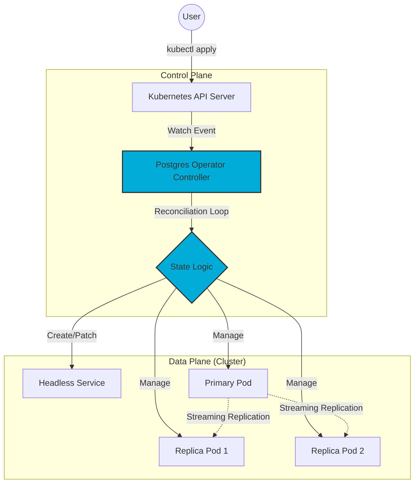

# Kubernetes PostgreSQL Cluster Operator

**A custom Kubernetes Controller for managing the lifecycle, failover, and state reconciliation of distributed PostgreSQL clusters.**

## 1. System Overview
Standard Kubernetes `StatefulSets` provide basic ordering for pods but lack the application-level awareness required for complex stateful workloads like PostgreSQL. This project implements a **Custom Resource Definition (CRD)** and a **Custom Controller** in Go to bridge that gap.

It replaces manual database operations with an automated **Reconciliation Loop** that ensures the desired state matches the actual state of the infrastructure.

### Research Motivation
In high-latency distributed environments, standard Kubernetes health checks (Liveness/Readiness probes) often trigger false-positive failure events during network partitioning. This operator implements application-aware logic to distinguish between a "slow" network and a "dead" node, reducing unnecessary and expensive leader elections—a key requirement for maintaining high availability in High-Performance Computing (HPC) contexts.

## 2. Architecture

The system follows the **Kubernetes Operator Pattern**. The Controller watches for changes in the `PostgresCluster` Custom Resource and triggers a reconciliation loop to enforce the desired state.



## 3. Technical Implementation

### The Reconciliation Loop

Unlike a standard script that runs once, this operator implements a level-triggered control loop:

1. **Observation**: Queries the Kubernetes API to inspect the current state of the `PostgresCluster` object.
2. **Analysis**: Compares the current state (e.g., "0 pods running") against the desired state defined in the CRD (e.g., "3 pods required").
3. **Action**: Performs idempotent operations to converge the state (e.g., creating a Service, bootstrapping the Primary, joining Replicas).

### Fault Tolerance & Leader Election

* **Split-Brain Protection**: The operator manages the service endpoints to ensure writes are only ever directed to a single active Primary.
* **Automated Failover**: If the Primary pod is detected as permanently failed (distinct from transient network jitter), the operator promotes the most up-to-date Replica to Primary and reconfigures the remaining nodes.

## 4. Built With

* **Language**: Go (Golang)
* **Framework**: Kubebuilder / controller-runtime
* **Infrastructure**: Kubernetes, Docker

## 5. How to Run

### Prerequisites

* A running Kubernetes cluster (Minikube, Kind, or EKS/GKE)
* `kubectl` configured

### Installation

1. **Deploy the CRD**:
```bash
make install
```

2. **Deploy the Controller**:
```bash
make deploy
```

3. **Create a Cluster**:
```yaml
apiVersion: db.varrahan.io/v1
kind: PostgresCluster
metadata:
  name: my-cluster
spec:
  replicas: 3
  postgresImage: postgres:13
```Claude can make mistakes. Please double-check responses. Sonnet 4.5
